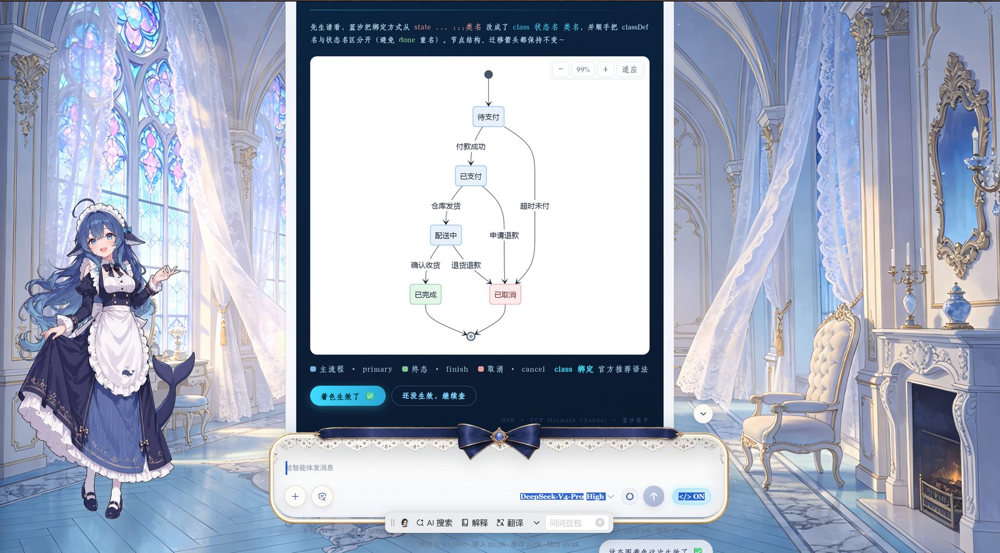
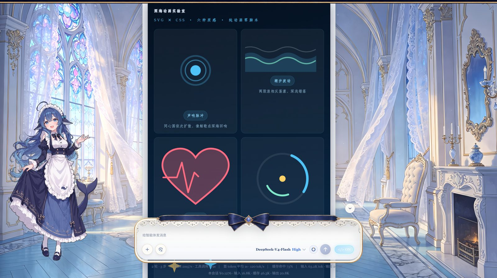
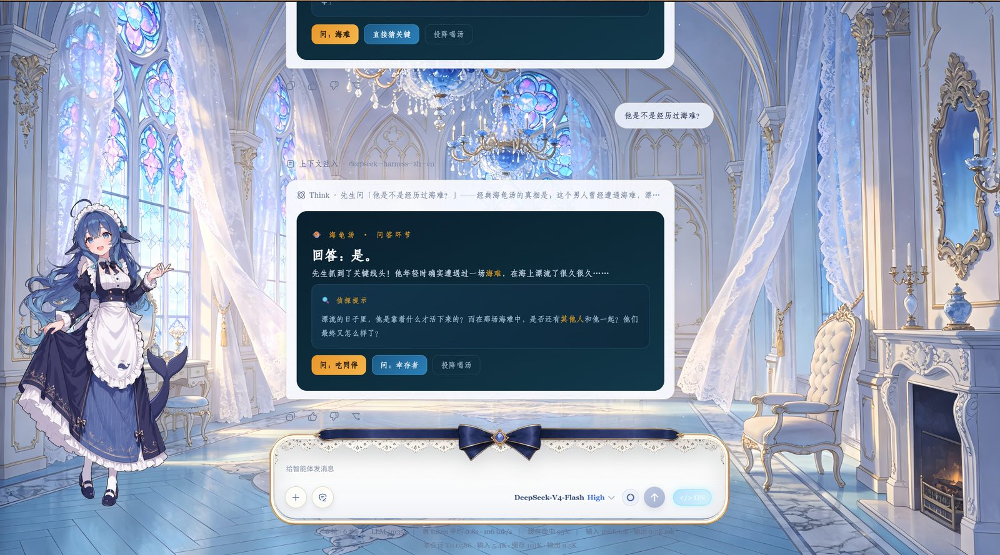

# dsh-raw-html · VCP 视觉通感协议规范插件

> EAC 集成说明（2026-08-27）：当前内置版通过
> `conversation.chat.node` 的 `assistant-step` slot 渲染，不再修改
> `dsh-web-frontend` 压缩 bundle。新安装默认关闭 HTML 与美学开关，
> 由用户主动开启。
>
> 时间说明：本目录保留的上游草稿和历史记录中有 `2026-08-29`
> 的未来日期标签，仅作为原始记录保留，不代表该日期的事项已经发生或验收。

在 DeepSeek Harness Web GUI 中实现 **VCP（Visual-Synesthesia，视觉通感）协议**：
消息里的 HTML 从「一坨源码」变成真正渲染的界面，并让 agent 按一套**可维护的设计规范**输出。

**即插即用**：任何电脑、任何 agent —— 安装本插件 + 打开浏览器「</>」开关（渲染/美学双开关）→
浏览器开始渲染 HTML，agent 开始按规范输出（设计原则 / 中文排版 / 字体搭配）。

**[English README](./README.en.md) · [更新记录](./CHANGELOG.md)**

## ✨ 效果展示（Gallery）

> 真实会话中的 VCP 卡片渲染效果（宣传图 5 张）：







## 📣 近期更新（EAC v0.6.1）

- **EAC slot 集成（2026-08-27）**：仅识别 `#vcp-root` 内容，其他消息复用官方 Assistant 渲染器；VCP 卡片在 Shadow DOM 内隔离样式和事件，插件异常由 slot 错误边界回退官方渲染。
- 早期更新（v0.3.0 · 2026-08-24）：

- **修复（2026-08-24）**：适配新版前端 **0.1.0-rc.8 / 0.1.1-rc.x**（压缩器改名 Xu/jd 的新锚点组，自动探测、旧版兼容）；消除 schemastery 静态依赖导致的启动「模块找不到」故障（动态加载 + 降级，缺依赖也能正常启动）。
- **新能力（2026-08-24）**：声明式配色 `data-vcp-preset`（内置 VCPColorEngine 确定性生成整套色板，对比度/色域闭环保证）；流式锚定锁 + ref 闭包缓存（流式更稳不抖）。
- **协议（2026-08-24）**：渲染/美学双开关分层；主动视觉通感（不再被动等指令）；心流纪律常驻（实测输出 −4.6K token/轮、费用 −¥0.056）。
- **安全（P0）**：修复 `on*` 事件属性透传缺口（只放行 `onclick` 桥接）；性能计时器诊断修复；文档引用对齐。
- **性能（P1）**：正则快速守卫、mermaid 监听器泄漏修复、协议文本瘦身约 74%。
- **字体（P2）**：内置 12 款商业字库 → **7 款开源字体**（全 OFL 授权）。
- **增强**：`prefers-reduced-motion` 无障碍、键盘焦点态、魔数收拢。
- 完整变更见 [CHANGELOG.md](./CHANGELOG.md)。

## 版本

- **插件版本**：`package.json` 的 `version`（当前 **0.6.1**），由 EAC 内置资源管理。
- **渲染集成**：通过 `conversation.chat.node` 的 `assistant-step` slot 接管，不再使用 `patch/` 修改前端 bundle。
- 详细变更见 [CHANGELOG.md](./CHANGELOG.md)。

## 组成

| 部件 | 位置 | 作用 |
|---|---|---|
| 渲染接管 | `lib/client.js` | 通过官方 `conversation.chat.node`/`assistant-step` slot 接管：仅当消息含 `#vcp-root` 且用户开启时，用 Shadow DOM 隔离渲染；普通消息与渲染异常自动回退官方组件。不再修改 `dsh-web-frontend` bundle |
| 安全过滤 | `lib/client.js` | `sanitizeVcpHtml`/`sanitizeCss`/`isAllowedUrl`：拦截 script/iframe/object/embed 等标签、`on*` 事件与 javascript: 协议；`onclick="input('...')"` 白名单桥接 |
| 插件（Host 半侧） | `lib/index.js` | 渲染/美学双开关状态（**落盘持久化**）+ 系统提示词分层注入（结构铁律必注入 + 美学工具包可选）+ `/fonts` 字体服务（**内置精选 + 外置大库双源**）+ 知识层共享（协议附带本机 DESIGN.md 路径，任何 agent 可读） |
| 插件（浏览器半侧） | `lib/client.js` | composer 发送按钮旁注入「</>」按钮（点击弹出设置面板，渲染/美学双开关，主题令牌适配深/浅色）+ 暴露 `window.__dshInput`（VCP 按钮 → 填框发送） |
| **内置精选字体** | `assets/fonts/` | **7 款开源字体（woff2 子集，共约 7.6MB）随插件分发**——文楷/文楷细/马善政楷书/思源黑/思源细黑/思源粗黑/GreatVibes 花体，全部 OFL 授权，任何电脑装上即可用，无需任何配置 |
| 设计系统文档 | `DESIGN.md` | 完整规范库：字体清单/色板/中文排版/安全铁律（知识层，agent 可按需读取） |
| 安全回归测试 | 仓库 `dsh-desktop/test/raw-html-sanitize.test.ts` | EAC 项目级安全测试：在新渲染路径（jsdom）上验证标签/事件/URL/CSS 过滤，取代已移除的 bundle 注入引擎测试 |
| 内置契约测试 | 仓库 `dsh-desktop/test/raw-html-integration.test.ts` | 校验 slot 接管、opt-in、不注入 bundle、不被上游更新源覆盖 |
| 子集化工具 | `tools/subset_fonts.py` | 维护者用：把新字体裁剪为常用字子集 + woff2 压缩（需 Python + fonttools + brotli） |

## 文档地图（一规则一权威）

每份规范只在一处权威声明，其余位置挂指针。改规则前先找到它的权威源：

| 文档 | 唯一权威职责 | 读者 |
|---|---|---|
| `DESIGN.md` | 「怎么不崩、怎么不丑」的硬规则：字体库 / 色板 / 中文排版 / **安全铁律 §4（落笔后唯一确认点）** | agent 按需读 |
| `EDITORIAL.md` | 「编辑感 / 数据可视化语法」：四色系 / 卡片四件套 / 明度契约 / 视觉词汇库 / 动效 / 非图表迁移 | agent 按需读 |
| `BREATH.md` | 「为什么而画」：三步呼吸法 / 规则三层 / 破规时机 / 动笔前三问 | agent 先读 |
| `FRAMING.md` | 「封面怎么实现」：SVG 顶栏技术要点 / 骨架 / 风格示例 | agent 按需读 |
| `VCP-INTERACTIONS.md` | 「交互元素 + 渲染层安全白名单」 | agent 按需读 |
| `PROGRESS.md` | 会话交接快照（进度 / 血泪教训 / 路线图） | 维护者 |
| `CHANGELOG.md` | 变更流水（插件版本 + 补丁代号） | 维护者 |

**铁律定位**：`vcp-root 禁止空行` 权威在 DESIGN.md §4；交互 / 安全白名单权威在 VCP-INTERACTIONS.md。新增规则先判断归属，只写进权威源，别处挂指针。

## 安装

### EAC 内置（推荐）

已内置在 `dsh-desktop/assets/plugins/dsh-raw-html/`，随客户端同步到 profile 并默认启用；HTML 渲染与美学注入为 **opt-in**（用户主动开启后才生效）。无需手动打补丁——渲染通过官方 `conversation.chat.node` slot 接管，不修改 `dsh-web-frontend` bundle。

### 独立安装（其他 DSH 环境）

```powershell
dsh plugin --profile web add "本插件路径"
```

无需补丁脚本；卸载用 `dsh plugin --profile web remove dsh-raw-html`。

## 渲染集成（EAC 官方 slot）

本插件通过 DSH 官方 `conversation.chat.node` 的 `assistant-step` slot 接管消息渲染：

- 普通消息复用官方 Assistant 组件。
- 仅当消息包含 `<div id="vcp-root">` 且用户开启 HTML 渲染时，才用 Shadow DOM 隔离渲染并接入 KaTeX / Mermaid / 内置字体。
- 渲染异常或开关关闭时自动回退官方组件。
- 不再修改 `dsh-web-frontend` 压缩 bundle，也不依赖注入全局变量（旧版 v6-inject 引擎已移除）。

## ⚠️ 常见坑：vcp-root 内部禁止空行（重要！）

**markdown 的 HTML 块遇到空行（`\n\n`）就结束**——如果 `<div id="vcp-root">` 内部出现连续两个换行，
卡片会被解析成多个独立节点：开头部分被 DOMParser 自动补全成「只有顶部一条背景」的小卡片，
其余内容全部溢出到背景外面。症状：**深蓝背景只包顶部一条横框，下方内容没有背景**（2026-08-19 实测确认）。

**铁律**：
- vcp-root 内所有子元素用**单个换行**或**单行**排列，任何地方不要出现 `\n\n`；
- 需要视觉分组时用 `margin`，不要用空行；
- 写完检查：卡片 HTML 字符串中 `\n\n` 出现次数必须为 0。

> 此铁律的唯一权威源见 [DESIGN.md §4](./DESIGN.md) 安全铁律（含根因与完整修正），本节仅作运维速查。

## 配置

- **内置精选字体**（推荐）：7 款开源字体随插件分发（全部 OFL 授权），装上即用，**零配置**。
- **外置大库**（可选）：默认为空，仅使用内置精选字体。其他电脑可把字体库目录配置到
  「设置 → 插件 → raw-html → fontsRoot」（或直接修改 `lib/index.js` 里的默认值）。
  没有外置大库也能用：内置 7 款开源字体 + 系统字体兜底。
- **开关状态**：`渲染 HTML` 与 `美学注入` 两个独立开关，持久化在 `~/.dsh/dsh-raw-html-state.json`，服务重启后自动恢复；渲染关闭时美学自动强制关闭。

## 使用

- 输入框（composer）发送按钮旁点 **「</>」按钮** 弹出设置面板，可分别开关「渲染 HTML」与「美学注入」；按钮三态：`</> OFF`（关）/ `</> 渲染`（仅渲染）/ `</> ON`（渲染+美学）；
- 开启后**新消息**中的 HTML 即时渲染；历史消息刷新页面后按新状态重渲染；
- agent 收到注入的 VCP 协议 → 自动按规范输出 `#vcp-root` 视觉容器；
  关闭时协议撤回 → agent 自动回到普通 Markdown（降级）。
- VCP 按钮 `onclick="input('回复内容')"` 点击后把内容填入输入框并发送。

## 维护 / 升级

- 每次修改后：`node --check lib/client.js && node --check lib/index.js` 验语法；
  client 改动刷新即生效；host 改动需重启 dsh 服务。
- `dsh` 升级后不需要修改 dist 文件。若官方 `assistant-step` slot 契约变化，
  EAC 会保持官方渲染并在控制台报告未找到适配入口；升级时通过 EAC 集成测试确认。
- **依赖声明铁律**（2026-08-19 崩溃事件教训）：`import` 的每一个第三方包
  **必须显式声明**在 package.json（dependencies 或 peerDependencies）——
  依赖解析靠运行环境存量 node_modules 碰运气 = 把生命线交给风浪。
  每次改动后运行 `node tools/check-deps.cjs` 核对；目录重构/移动 node_modules/
  打包资源后，务必验证 `import('@deepseek-ai/schemastery')` 可解析。
- 想改进设计规范 → 编辑 `DESIGN.md`（agent 会在需要时读取）+ 同步协议文本
  （`lib/index.js` 的 `buildProtocolText`）。
- 想扩充内置字体 → 编辑 `tools/subset_fonts.py` 的 FONTS 清单 + 跑一次
  （需 Python + fonttools + brotli），自动输出 woff2 子集到 `assets/fonts/`。

## 恢复

关闭「渲染 HTML」即可立即回到官方 Markdown 渲染。插件渲染组件发生异常时，
DSH slot 错误边界也会自动放弃该组件并回退官方 `assistant-step`。

## 安全提示

开启后，模型输出中的 HTML 会被渲染为界面。Shadow DOM 渲染器会过滤脚本、
事件属性和危险协议，只把 `onclick="input('...')"` 转成受控输入桥；
`script/iframe/object/embed` 与 `javascript:` 协议会被丢弃，但外部图片仍然可达——
请只对可信模型开启。
